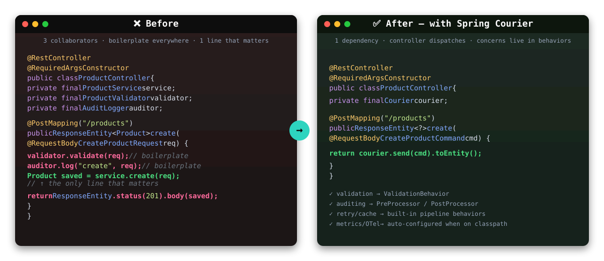

<p align="center">
  
</p>

<h1 align="center">Spring Courier</h1>

<p align="center">
  🚀 Uma biblioteca Java para simplificar a implementação do padrão <strong>CQRS + Mediator</strong> em aplicações <strong>Spring Boot</strong>.
</p>

<p align="center">
  <a href="https://central.sonatype.com/artifact/io.github.valossa515/spring-courier"></a>
  <a href="https://openjdk.org/projects/jdk/21/"></a>
  <a href="https://spring.io/projects/spring-boot"></a>
  <a href="LICENSE"></a>
</p>

<p align="center">
  <a href="https://github.com/Valossa515/spring-courier/stargazers"></a>
  <a href="https://sonarcloud.io/summary/new_code?id=Valossa515_spring-courier"></a>
  <a href="https://sonarcloud.io/component_measures?metric=coverage&id=Valossa515_spring-courier"></a>
  <a href="https://github.com/Valossa515/spring-courier/actions/workflows/publish-maven-central.yml"></a>
  <a href="https://github.com/Valossa515/spring-courier/commits/main"></a>
</p>

---

> 🌐 **Language / Idioma:** 🇧🇷 **Português** (atual) | 🇺🇸 [English](README.md)

## 🧠 Por que Spring Courier?

A **experiência do MediatR para Spring Boot** — sem escrever seu próprio dispatcher, sem framework de event sourcing, sem abandonar os idiomas do Spring.

- 🎯 **CQRS em 3 linhas** — defina um request, um handler, chame `courier.send(...)`. Sem boilerplate de registro, sem classes base abstratas.
- 🛡️ **Pronto para produção de imediato** — retries, cache, idempotência, validação, OpenTelemetry, métricas Micrometer, alertas nativos no Slack.
- ⚡ **Nativo do Java 21** — virtual threads, hierarquia de exceções selada, pattern matching. JAR de ~150 KB, zero dependências em runtime além do Spring.

## 🔄 Antes / Depois

<p align="center">
  
</p>

<details>
<summary>Ver o mesmo comparativo em código puro</summary>

**Antes** — um controller conhece serviços, transações, validação, logging:

```java
@RestController
@RequiredArgsConstructor
public class ProductController {
    private final ProductService service;
    private final ProductValidator validator;
    private final AuditLogger auditor;

    @PostMapping("/products")
    public ResponseEntity<Product> create(@RequestBody CreateProductRequest req) {
        validator.validate(req);            // boilerplate
        auditor.log("create", req);         // boilerplate
        Product saved = service.create(req);// a única linha que importa
        return ResponseEntity.status(201).body(saved);
    }
}
```

**Depois** — o controller só despacha; concerns transversais ficam em pipeline behaviors:

```java
@RestController
@RequiredArgsConstructor
public class ProductController {
    private final Courier courier;

    @PostMapping("/products")
    public ResponseEntity<?> create(@RequestBody CreateProductCommand cmd) {
        return courier.send(cmd).toEntity();
    }
}
```

</details>

## ⚡ Quick Start em 60 segundos

**1.** Adicione a dependência:

```xml
<dependency>
    <groupId>io.github.valossa515</groupId>
    <artifactId>spring-courier</artifactId>
    <version>4.0.0</version>
</dependency>
```

**2.** Defina um command e seu handler:

```java
public record CreateProductCommand(String name, BigDecimal price)
        implements ICommand<Product> {}

@Service
public class CreateProductHandler
        implements CommandHandler<CreateProductCommand, Product> {
    public Product handle(CreateProductCommand cmd) {
        return new Product(UUID.randomUUID(), cmd.name(), cmd.price());
    }
}
```

**3.** Despache em qualquer lugar onde `Courier` for injetado:

```java
Response<Product> response = courier.send(new CreateProductCommand("Book", BigDecimal.TEN));
```

E pronto. A auto-configuração descobre o handler no contexto Spring — sem registro manual.

## 🆚 Comparativo

| Capacidade                                | Spring Courier | Axon Framework | Spring Modulith | Mediator Manual |
|-------------------------------------------|:-------------:|:--------------:|:---------------:|:---------------:|
| API `send()` / `publish()` estilo MediatR | ✅            | ⚠️ (pesado)    | ❌              | DIY             |
| Auto-discovery sem configuração            | ✅            | ❌             | ⚠️              | ❌              |
| Retry / cache / idempotência embutidos    | ✅            | ⚠️             | ❌              | ❌              |
| Virtual threads (Java 21)                 | ✅            | ❌             | ❌              | ⚠️              |
| Integração OpenTelemetry + Micrometer     | ✅            | ⚠️             | ⚠️              | DIY             |
| Alertas nativos no Slack (sem Grafana)    | ✅            | ❌             | ❌              | ❌              |
| Event sourcing / sagas                    | ❌            | ✅             | ❌              | ❌              |
| Footprint                                 | ~150 KB       | Plataforma     | Arquitetural    | n/a             |

> **TL;DR:** escolha Spring Courier quando você quer a *experiência de dev do MediatR* no Spring. Escolha Axon quando precisar de event sourcing e CQRS no nível arquitetural. Escolha Modulith quando quiser fronteiras de módulos dentro de um monolito.

## ✨ Recursos

<details>
<summary><b>🎯 CQRS Core</b> — commands, queries, notifications, batch dispatch, contexto por request</summary>

- **Handlers de Command/Query/Notification** com um único ponto de entrada `Courier`
- **Auto-discovery** de handlers no contexto Spring (`@Service`, `@Component`, `@ExposeHandler`)
- **`Response<T>`** com success/error/status, conversível em `ResponseEntity`
- **Batch dispatch** — `sendAll()` / `sendAllAsync()` para múltiplos requests
- **`CourierContext`** — contexto por request com correlation ID, propagado em virtual threads
- **Respostas de erro tipadas** — `errorWithDetails()` para erros estruturados por campo

</details>

<details>
<summary><b>🛡️ Confiabilidade</b> — retry, cache, idempotência, validação, timeouts</summary>

- **Retry behavior** — backoff exponencial para falhas transientes
- **Caching behavior** — cache em memória para queries com TTL e evição por tamanho
- **`@Idempotent`** — deduplicação automática de comandos com TTL configurável
- **Pipeline de validação** — validação fail-fast antes do handler executar
- **`@Timeout`** — override por request do timeout async global

</details>

<details>
<summary><b>📊 Observabilidade</b> — Micrometer, OpenTelemetry, Slack, Actuator</summary>

- **Métricas Micrometer** — timers, counters, gauges, long task timers (prontos pro Prometheus)
- **Tracing OpenTelemetry** — spans automáticos por request com correlation ID
- **Alertas nativos no Slack** — alerting embutido (error ratio, p99, timeouts, queda de throughput) sem Grafana/Alertmanager
- **Dashboard Grafana** — JSON pronto pra importar em `docs/grafana/`
- **Endpoint Actuator** — `/actuator/courier` expondo estado dos registries

</details>

<details>
<summary><b>🧪 Testes & Extensibilidade</b> — Test DSL, behaviors, processors, converters customizados</summary>

- **Test DSL** — builder `CourierTestSupport` para testes unitários sem contexto Spring
- **`PipelineBehavior<R, S>`** — concerns transversais com execução ordenada
- **Pre/Post processors** — hooks leves antes e depois do handler
- **`ResponseEntityConverter`** — mapeamento HTTP plugável

</details>

<details>
<summary><b>🚀 Runtime & Plataforma</b> — Java 21, virtual threads, sealed types, GraalVM</summary>

- **Virtual threads por padrão** para publicação assíncrona
- **Hierarquia de exceções selada** para pattern matching exaustivo
- **GraalVM native image** com reflection hints incluídos
- Compatível com **Spring Boot 3.x e 4.x**

</details>

---

<details>
<summary><h2 style="display:inline">☕ Java 21 — O que mudou</h2></summary>

A partir da versão **2.0.0**, o Spring Courier requer **Java 21+** (LTS). Essa atualização traz melhorias significativas de performance e type safety:

### 🧵 Virtual Threads

O `publishAsync()` agora utiliza **Virtual Threads** por padrão quando nenhum executor customizado é configurado. Isso substitui o `ForkJoinPool` common pool e oferece:

- **Escalabilidade massiva** — milhares de notificações assíncronas sem thread starvation
- **Custo mínimo** — virtual threads são ordens de magnitude mais leves que platform threads
- **Zero configuração** — funciona out-of-the-box; você ainda pode fornecer seu próprio `Executor` se preferir

```java
// Usa virtual threads automaticamente (Java 21)
courier.publishAsync(new ProductCreatedEvent(id, name));

// Ou com executor customizado (opcional)
@Bean
public Executor courierAsyncExecutor() {
    return Executors.newFixedThreadPool(10);
}
```

### 🔒 Sealed Exception Hierarchy

A hierarquia de exceções agora é **selada** (`sealed`), garantindo que apenas `HandlerNotFoundException` e `ValidationException` estendam `CourierException`:

```java
public sealed class CourierException extends RuntimeException
        permits HandlerNotFoundException, ValidationException { }
```

Isso permite **pattern matching exaustivo** no tratamento de erros:

```java
try {
    courier.send(command);
} catch (CourierException ex) {
    switch (ex) {
        case HandlerNotFoundException e -> log.error("Handler não encontrado: {}", e.getMessage());
        case ValidationException e      -> log.warn("Validação falhou: {} erros", e.getErrors().size());
    }
}
```

### 🔀 Pattern Matching & Switch Expressions

O código interno da biblioteca foi refatorado para utilizar **pattern matching in switch** e **switch expressions** do Java 21, tornando o código mais conciso e seguro.

> ⚠️ **Breaking change:** Se sua aplicação roda em Java 17, 18, 19 ou 20, permaneça na versão **1.x** do Spring Courier.

</details>

---

## ⚙️ Instalação

Adicione a dependência no seu `pom.xml` ou `build.gradle`:

```xml
<dependency>
    <groupId>io.github.valossa515</groupId>
    <artifactId>spring-courier</artifactId>
    <version>4.0.0</version>
</dependency>
```

```groovy
implementation("io.github.valossa515:spring-courier:4.0.0")
```

> 🔧 É necessário ter o **Java 21+** e **Spring Boot 3.x+**.

---

## 🚀 Exemplo de Uso

### 1️⃣ Criando um Command e um Handler

```java
public record CreateProductCommand(String name, BigDecimal price) implements ICommand<CreateProductResponse> {}

@Service
public class CreateProductHandler implements CommandHandler<CreateProductCommand, CreateProductResponse> {

    @Override
    public CreateProductResponse handle(CreateProductCommand command) {
        // Lógica de criação do produto
        return new CreateProductResponse(UUID.randomUUID(), command.name(), command.price());
    }
}
```

---

### 2️⃣ Enviando o Command com o `Courier`

```java
@RestController
@RequestMapping("/products")
@RequiredArgsConstructor
public class ProductController {

    private final Courier courier;

    @PostMapping
    public ResponseEntity<CreateProductResponse> create(@RequestBody CreateProductCommand command) {
        var response = courier.send(command);
        return ResponseEntity.ok(response);
    }
}
```

---

### 3️⃣ Exemplo de Query

```java
public record GetProductByIdQuery(UUID id) implements IQuery<GetProductResponse> {}

@Service
public class GetProductByIdHandler implements QueryHandler<GetProductByIdQuery, GetProductResponse> {
    @Override
    public GetProductResponse handle(GetProductByIdQuery query) {
        // Buscar no repositório, retornar DTO
        return new GetProductResponse(query.id(), "Example Product", BigDecimal.valueOf(19.90));
    }
}
```

---

### 4️⃣ Publicando Notificações/Eventos

```java
// Definindo uma notificação
public record ProductCreatedEvent(UUID productId, String name) implements INotification {}

// Handler 1 - Enviar email
@Service
public class SendEmailOnProductCreated implements NotificationHandler<ProductCreatedEvent> {
    @Override
    public void handle(ProductCreatedEvent event) {
        // Lógica para enviar email
        System.out.println("Email enviado para produto: " + event.name());
    }
}

// Handler 2 - Atualizar cache
@Service
public class UpdateCacheOnProductCreated implements NotificationHandler<ProductCreatedEvent> {
    @Override
    public void handle(ProductCreatedEvent event) {
        // Lógica para atualizar cache
        System.out.println("Cache atualizado para produto: " + event.productId());
    }
}

// Publicando a notificação
@Service
public class ProductService {
    private final Courier courier;
    
    public void createProduct(String name) {
        // ... criar produto ...
        
        // Publica notificação - todos os handlers serão executados
        courier.publish(new ProductCreatedEvent(UUID.randomUUID(), name));
        
        // Ou de forma assíncrona
        courier.publishAsync(new ProductCreatedEvent(UUID.randomUUID(), name));
    }
}
```

---

### 5️⃣ Validação com Pipeline Behaviors

```java
// Definindo um validador
public class CreateProductValidator implements Validator<CreateProductCommand> {
    @Override
    public ValidationResult validate(CreateProductCommand command) {
        List<ValidationError> errors = new ArrayList<>();
        
        if (command.name() == null || command.name().isEmpty()) {
            errors.add(new ValidationError("name", "Nome não pode ser vazio"));
        }
        
        if (command.price() == null || command.price().compareTo(BigDecimal.ZERO) <= 0) {
            errors.add(new ValidationError("price", "Preço deve ser maior que zero"));
        }
        
        return errors.isEmpty() ? ValidationResult.success() : ValidationResult.failure(errors);
    }
}

// Registrando o behavior de validação
@Bean
public ValidationBehavior<CreateProductCommand, CreateProductResponse> productValidationBehavior() {
    return new ValidationBehavior<>(List.of(new CreateProductValidator()));
}
```

---

### 6️⃣ API do Response

`Response<T>` é um value object imutável que encapsula o resultado de cada operação. Ele carrega o payload, uma mensagem de erro opcional, um flag de sucesso e um código de status HTTP.

#### Factory Methods

| Método | Status Code | Descrição |
|--------|-------------|--------|
| `Response.success(data)` | `200` | Resposta de sucesso com payload |
| `Response.success(data, statusCode)` | customizado | Resposta de sucesso com status customizado (ex: `201 Created`) |
| `Response.success()` | `200` | Resposta de sucesso sem payload |
| `Response.error(message)` | `500` | Resposta de erro com mensagem |
| `Response.error(message, statusCode)` | customizado | Resposta de erro com status customizado (ex: `400`, `404`) |
| `Response.error(throwable)` | `500` | Resposta de erro a partir de exceção |
| `Response.error(throwable, statusCode)` | customizado | Resposta de erro a partir de exceção com status customizado |
| `Response.validationError(message, statusCode)` | customizado | Erro de validação (marcado para métricas) |

> **Nota de segurança:** Apenas mensagens de `CourierException` são propagadas na resposta. Todos os outros tipos de exceção recebem uma mensagem genérica `"An internal error occurred"` para evitar vazamento de informações.

#### Exemplos de Uso

```java
// Dentro de um handler — retorne diferentes status codes baseado na lógica de negócio
@Component
public class CreateProductHandler implements CommandHandler<CreateProductCommand, Response<Product>> {

    @Override
    public Response<Product> handle(CreateProductCommand cmd) {
        if (cmd.getName() == null || cmd.getName().isBlank()) {
            return Response.error("Product name is required", 400);  // Bad Request
        }

        if (productRepository.existsByName(cmd.getName())) {
            return Response.error("Product already exists", 409);    // Conflict
        }

        Product product = productRepository.save(new Product(cmd.getName()));
        return Response.success(product, 201);                       // Created
    }
}
```

#### Métodos de Inspeção

| Método | Retorno | Descrição |
|--------|---------|--------|
| `isSuccess()` | `boolean` | Se a operação foi bem-sucedida |
| `hasData()` | `boolean` | Se a resposta contém payload |
| `hasError()` | `boolean` | Se a resposta contém mensagem de erro |
| `getData()` | `T` | O payload (pode ser `null`) |
| `getError()` | `String` | A mensagem de erro (pode ser `null`) |
| `getStatusCode()` | `int` | O código de status HTTP |
| `getDataOrThrow()` | `T` | Retorna os dados ou lança `ResponseException` em caso de erro |

---

### 7️⃣ Conversão de Response

O Spring Courier oferece dois mecanismos para converter `Response<T>` no `ResponseEntity` do Spring:

#### Conversão direta com `toEntity()`

```java
@PostMapping
public ResponseEntity<Response<CreateProductResponse>> create(@RequestBody CreateProductCommand cmd) {
    return courier.send(cmd).toEntity();        // 200 com body
}

@DeleteMapping("/{id}")
public ResponseEntity<Response<Void>> delete(@PathVariable UUID id) {
    return courier.send(new DeleteProductCommand(id)).toEntity(false); // 204 No Content
}
```

O overload `toEntity(boolean includeBody)` retorna `204 No Content` quando `includeBody` é `false` e a resposta é sucesso — ideal para operações de escrita que não produzem payload.

#### Conversão plugável com `ResponseEntityConverter`

Um bean `ResponseEntityConverter` é autoconfigurado e pode ser injetado nos controllers:

```java
@RestController
@RequestMapping("/products")
@RequiredArgsConstructor
public class ProductController {

    private final Courier courier;
    private final ResponseEntityConverter converter;

    @PostMapping
    public ResponseEntity<?> create(@RequestBody CreateProductCommand cmd) {
        return converter.convert(courier.send(cmd));
    }
}
```

Para customizar a conversão globalmente, declare seu próprio bean — o padrão é substituído automaticamente:

```java
@Bean
public ResponseEntityConverter customConverter() {
    return response -> {
        if (!response.isSuccess()) {
            return ResponseEntity.status(response.getStatusCode())
                .header("X-Error-Type", response.getExceptionType())
                .body(response);
        }
        return response.toEntity();
    };
}
```

---

<details>
<summary><h2 style="display:inline">📚 Recursos Avançados (clique para expandir)</h2></summary>

## 🔁 Caching Behavior

Cache automático para resultados de `IQuery` em memória. Commands sempre ignoram o cache.

**Ativação:**

```properties
spring.courier.cache.enabled=true
spring.courier.cache.ttl-seconds=300     # Tempo de vida (default: 300)
spring.courier.cache.max-size=1000       # Máximo de entradas cacheadas (default: 1000)
```

```java
// Queries são cacheadas automaticamente — queries idênticas retornam o resultado cacheado
Response<Product> first  = courier.send(new GetProductQuery(id));  // executa handler
Response<Product> second = courier.send(new GetProductQuery(id));  // retorna cache
```

---

## 🔄 Retry Behavior

Retry de requests que falharam com **backoff exponencial** sempre que o handler lança uma exceção.

**Ativação:**

```properties
spring.courier.retry.enabled=true
spring.courier.retry.max-attempts=3       # Total de tentativas (default: 3)
spring.courier.retry.delay-ms=200         # Delay inicial em ms (default: 200)
spring.courier.retry.multiplier=2.0       # Multiplicador do backoff (default: 2.0)
```

Fórmula do delay: `delay × multiplier^(tentativa - 1)` → 200ms, 400ms, 800ms...

---

## 🔍 OpenTelemetry Tracing

Cria um span para cada chamada `send()` com tipo do request, categoria CQRS e correlation ID como atributos.

**Ativação:** Adicione `opentelemetry-api` ao classpath e forneça um bean `Tracer`:

```xml
<dependency>
    <groupId>io.opentelemetry</groupId>
    <artifactId>opentelemetry-api</artifactId>
</dependency>
```

Os spans são nomeados `courier.<RequestType>` (ex: `courier.CreateProductCommand`) e incluem:
- `courier.request.type` — ex: `CreateProductCommand`
- `courier.request.category` — `command`, `query` ou `request`
- `courier.correlation.id` — do `CourierContext`

---

## 📦 Batch Dispatch

Envie múltiplos requests em uma única chamada:

```java
// Sequencial — processa um por um, para no primeiro erro
List<Response<?>> results = courier.sendAll(List.of(cmd1, cmd2, cmd3));

// Paralelo — despacha todos concorrentemente via virtual threads
CompletableFuture<List<Response<?>>> future = courier.sendAllAsync(List.of(cmd1, cmd2, cmd3));
List<Response<?>> asyncResults = future.join();
```

---

## ⏱️ @Timeout Por Request

Sobrescreva o timeout global de async em tipos de request individuais:

```java
@Timeout(5000)  // 5 segundos ao invés do default global de 30s
public record SlowExportCommand(String reportId) implements ICommand<String> {}
```

---

## 🔑 Idempotency Key

Deduplica automaticamente commands anotados com `@Idempotent`:

```java
@Idempotent(ttlSeconds = 3600)  // Cache do resultado por 1 hora
public record CreateOrderCommand(String orderId) implements ICommand<OrderResult> {}
```

Requests duplicados (mesma classe + chave `toString()`) retornam o `Response` cacheado sem re-executar o handler.

**Ativação:**

```properties
spring.courier.idempotency.enabled=true
spring.courier.idempotency.max-size=10000  # Máximo de chaves armazenadas (default: 10000)
```

---

## 🧵 CourierContext

Contexto por request criado automaticamente em cada chamada `send()`. Carrega um **correlation ID** e um bag de atributos de uso geral:

```java
// Dentro de um handler ou pipeline behavior
CourierContext ctx = CourierContextHolder.getContext();
String correlationId = ctx.getCorrelationId();

// Armazene atributos customizados (imutável — retorna novo contexto)
ctx = ctx.with("userId", currentUser.getId());
String userId = ctx.<String>get("userId").orElseThrow();
```

O contexto é automaticamente propagado para:
- Pipeline behaviors, pre/post processors
- Virtual threads usadas por `invokeHandler()` e `sendAsync()`

---

## 🧩 Typed Error Responses

Anexe payloads de erro estruturados às respostas de erro:

```java
// Lista de field errors
List<FieldError> errors = List.of(
    new FieldError("name", "não pode ser vazio"),
    new FieldError("email", "formato inválido"));

Response<Void> response = Response.errorWithDetails("Validação falhou", 400, errors);

// Recupere no call site
List<FieldError> details = response.getErrorDetails();
boolean hasDetails = response.hasErrorDetails();
```

Também disponível: `Response.validationErrorWithDetails(message, statusCode, details)` e `Response.builder().errorDetails(...)`.

---

## ⚙️ Pre/Post Processors

Hook no ciclo de vida do request sem escrever um `PipelineBehavior` completo:

```java
@Component
public class AuditPreProcessor implements PreProcessor<IRequest<?>> {
    @Override
    public void process(IRequest<?> request) {
        log.info("Processando: {}", request.getClass().getSimpleName());
    }
}

@Component
public class MetricsPostProcessor implements PostProcessor<IRequest<?>, Object> {
    @Override
    public void process(IRequest<?> request, Object response) {
        log.info("Concluído: {}", request.getClass().getSimpleName());
    }
}
```

---

## 🧪 Test DSL — `CourierTestSupport`

Construa uma instância `Courier` completa em testes unitários sem Spring application context:

```java
Courier courier = CourierTestSupport.builder()
    .withHandler(CreateOrder.class, new CreateOrderHandler())
    .withHandler(GetOrder.class, new GetOrderHandler())
    .withBehavior(new LoggingBehavior<>())
    .withPreProcessor(req -> log.info("pre: {}", req))
    .withTimeout(5000)
    .build();

Response<OrderResult> result = courier.send(new CreateOrder(...));
```

Atalho para instância mínima: `CourierTestSupport.emptyCourier()`.

---

## 📈 Observabilidade (Micrometer / Prometheus / Grafana)

A partir da versão **1.4.0**, o Spring Courier possui instrumentação **opcional** com [Micrometer](https://micrometer.io/), permitindo exportar métricas para Prometheus, Grafana e outros backends.

### Ativação

Basta adicionar o `micrometer-core` (ou `spring-boot-starter-actuator`) ao classpath da sua aplicação. O Spring Courier detecta automaticamente e substitui o `Courier` padrão por um `MeteredCourier` instrumentado.

```xml
<!-- Se sua aplicação já usa Actuator, não precisa de mais nada -->
<dependency>
    <groupId>org.springframework.boot</groupId>
    <artifactId>spring-boot-starter-actuator</artifactId>
</dependency>
```

Para desabilitar as métricas:

```properties
spring.courier.metrics.enabled=false
```

### Métricas Disponíveis

#### ⏱️ Timers (latência com percentis p50, p95, p99)

| Métrica                          | Descrição                                  | Tags                                            |
|----------------------------------|--------------------------------------------|------------------------------------------------|
| `courier.send.duration`          | Tempo de execução de commands/queries      | `request.type`, `request.category`, `outcome`  |
| `courier.send.async.duration`    | Tempo de execução assíncrona de commands/queries | `request.type`, `request.category`, `outcome`  |
| `courier.publish.duration`       | Tempo de publicação de notificações        | `notification.type`                            |
| `courier.publish.async.duration` | Tempo de publicação assíncrona             | `notification.type`                            |
| `courier.batch.send.duration`    | Tempo de execução de batch dispatch        | —                                              |

#### 🔢 Counters (throughput e erros)

| Métrica                        | Descrição                               | Tags                               |
|--------------------------------|-----------------------------------------|------------------------------------|
| `courier.send`                 | Total de requests despachados           | `request.type`, `outcome`          |
| `courier.publish`              | Total de notificações publicadas        | `notification.type`                |
| `courier.handler.errors`       | Erros em handlers (exclui validação)    | `request.type`, `exception.type`   |
| `courier.handler.timeouts`     | Timeouts de handlers async              | —                                  |
| `courier.validation.failures`  | Falhas de validação no pipeline         | `request.type`                     |
| `courier.cache.hits`           | Contagem de cache hits                  | `request.type`                     |
| `courier.cache.misses`         | Contagem de cache misses                | `request.type`                     |
| `courier.retry.attempts`       | Contagem de tentativas de retry         | `request.type`                     |
| `courier.retry.exhausted`      | Retries esgotados (todas tentativas falharam) | `request.type`               |
| `courier.idempotency.hits`     | Request idempotente deduplicado (cache) | `request.type`                     |
| `courier.idempotency.misses`   | Request idempotente executado (primeiro)| `request.type`                     |
| `courier.batch.send.size`      | Distribuição de tamanho dos batch dispatches   | —                            |

> **Nota:** `handler.errors` e `validation.failures` são mutuamente exclusivos — um request com falha incrementa um ou outro, nunca ambos.

#### 📊 Gauges (estado do registro)

| Métrica                                    | Descrição                                      |
|--------------------------------------------|------------------------------------------------|
| `courier.handlers.registered`              | Quantidade de command/query handlers registrados|
| `courier.notification.handlers.registered` | Quantidade de notification handlers registrados |
| `courier.pipeline.behaviors.registered`    | Quantidade de pipeline behaviors registrados    |

#### ⏱️ Long Task Timers (rastreamento de requests em andamento)

| Métrica                                    | Descrição                                      |
|--------------------------------------------|------------------------------------------------|
| `courier.requests.in.flight`               | Quantidade de requests sendo processados        |

#### 🏷️ Tags

| Tag                  | Valores possíveis                   | Descrição                         |
|----------------------|-------------------------------------|-----------------------------------|
| `request.type`       | Nome simples da classe do request   | Ex: `CreateProductCommand`        |
| `request.category`   | `command`, `query`, `request`       | Tipo do request (CQRS)            |
| `notification.type`  | Nome simples da classe da notificação| Ex: `ProductCreatedEvent`        |
| `outcome`            | `success`, `error`                  | Resultado da operação             |
| `exception.type`     | Nome simples da exceção             | Tipo da exceção capturada         |

### Exemplo com Prometheus + Grafana

1. Adicione `micrometer-registry-prometheus` à sua aplicação:

```xml
<dependency>
    <groupId>io.micrometer</groupId>
    <artifactId>micrometer-registry-prometheus</artifactId>
</dependency>
```

2. Exponha o endpoint de métricas no `application.properties`:

```properties
management.endpoints.web.exposure.include=prometheus,health,metrics
management.metrics.export.prometheus.enabled=true
spring.courier.metrics.enabled=true
```

3. Configure o Prometheus para fazer scrape do endpoint `/actuator/prometheus`.

4. Importe o dashboard Grafana disponível em [`docs/grafana/courier-dashboard.json`](docs/grafana/courier-dashboard.json).

> 📖 Consulte o [Guia de PromQL](docs/grafana/PROMQL_REFERENCE.md) para queries prontas para monitoramento.

### 🔔 Alertas no Slack

#### Via Grafana (externa)

A partir da versão **1.6.0**, o Spring Courier inclui configurações prontas para alertas no **Slack** via **Grafana Unified Alerting**. Os alertas são baseados nas métricas exportadas pelo Micrometer e coletadas pelo Prometheus.

1. Crie um [Slack Incoming Webhook](https://api.slack.com/messaging/webhooks) para o canal desejado
2. Copie os arquivos de provisioning de `docs/grafana/provisioning/` para o diretório de provisioning do Grafana
3. Reinicie o Grafana

> 📖 Consulte o [Guia completo de Slack Alerting](docs/grafana/SLACK_ALERTING.md) para instruções detalhadas de configuração.

#### 🆕 Via Spring Courier Nativo (sem Grafana)

A partir da versão **1.7.0**, o Spring Courier traz **alertas nativos no Slack** — sem necessidade de Grafana, Prometheus Alertmanager ou qualquer infraestrutura de alerting externa. Basta configurar o webhook e a biblioteca avalia as métricas automaticamente, enviando notificações direto para o Slack.

**Ativação:**

Adicione a configuração ao `application.properties`:

```properties
# Obrigatório — ativa o alerting nativo
spring.courier.slack.webhook-url=https://hooks.slack.com/services/T.../B.../xxx

# Opcional — canal Slack (sobrescreve o default do webhook)
spring.courier.slack.channel=#courier-alerts

# Opcional — nome da aplicação nos alertas (default: Spring Courier)
spring.courier.slack.app-name=minha-api
```

> ⚠️ Para o alerting nativo funcionar, o Micrometer (`spring-boot-starter-actuator`) precisa estar no classpath e `spring.courier.metrics.enabled=true` (habilitado por padrão).

**Alertas Disponíveis:**

| Alerta | Condição | Severidade |
|--------|----------|------------|
| **High Error Ratio** | Error ratio > 5% | `warning` |
| **High p99 Latency** | p99 send > 1s | `warning` |
| **Handler Timeouts** | Timeouts detectados | `critical` |
| **Validation Spike** | Falhas de validação > 10/s | `warning` |
| **Throughput Drop** | Queda de throughput > 50% | `critical` |

**Configurações Avançadas:**

```properties
# Intervalo de avaliação das regras (10–3600s, default: 60s)
spring.courier.slack.evaluation-interval-seconds=60

# Cooldown entre alertas repetidos do mesmo tipo (1–1440min, default: 15min)
spring.courier.slack.cooldown-minutes=15

# Tempo mínimo que a condição deve se manter antes de disparar (default: 300s)
spring.courier.slack.for-duration-seconds=300

# Thresholds personalizáveis
spring.courier.slack.thresholds.error-ratio=0.05
spring.courier.slack.thresholds.p99-latency-seconds=1.0
spring.courier.slack.thresholds.validation-rate=10.0
spring.courier.slack.thresholds.throughput-drop-ratio=0.5
```

**Ciclo de vida dos alertas:** `OK → PENDING → FIRING → RESOLVED`

- **PENDING:** A condição foi detectada, mas ainda não atingiu o tempo mínimo (`for-duration-seconds`)
- **FIRING:** A condição se manteve e uma notificação foi enviada ao Slack (com cooldown entre re-notificações)
- **RESOLVED:** A condição normalizou — uma mensagem de resolução é enviada automaticamente

**Para desabilitar:**

```properties
spring.courier.slack.enabled=false
```

</details>

---

## 🧩 Estrutura do Projeto

```
spring-courier/
 ├── src/main/java/dev/valossa/springcourier/
 │    ├── core/               # Contratos e abstrações principais
 │    ├── annotations/        # Anotações utilitárias
 │    └── config/             # Configurações da lib
 ├── docs/diagrams/           # Diagramas UML da arquitetura
 └── pom.xml
```

---

## 📊 Diagramas e Arquitetura

Para entender melhor a arquitetura e funcionamento da biblioteca, consulte os **diagramas UML** disponíveis na pasta [`docs/diagrams/`](docs/diagrams/):

- 🎯 **[Visão Geral da Arquitetura](docs/diagrams/architecture-overview.puml)** - Diagrama simplificado do fluxo principal
- 🏗️ **[Diagrama de Classes](docs/diagrams/class-diagram.puml)** - Estrutura de classes e interfaces
- 🔄 **[Diagrama de Sequência - Command/Query](docs/diagrams/sequence-diagram-command.puml)** - Fluxo de execução de commands e queries
- 📢 **[Diagrama de Sequência - Notificações](docs/diagrams/sequence-diagram-notification.puml)** - Publicação de eventos
- 📋 **[Diagrama de Atividades](docs/diagrams/activity-diagram.puml)** - Fluxo de processamento de requests
- 👤 **[Diagrama de Casos de Uso](docs/diagrams/use-case-diagram.puml)** - Funcionalidades e casos de uso
- 🧩 **[Diagrama de Componentes](docs/diagrams/component-diagram.puml)** - Arquitetura de componentes
- 🚀 **[Diagrama de Implantação](docs/diagrams/deployment-diagram.puml)** - Estrutura de deployment
- 🔀 **[Diagrama de Estados](docs/diagrams/state-diagram.puml)** - Ciclo de vida de requests

> 💡 Os diagramas estão em formato PlantUML. Veja o [README dos diagramas](docs/diagrams/README.md) para instruções de visualização.

---

## 🧱 Integração com Spring Boot

O Spring Courier possui **auto-configuração** habilitada por padrão. Basta adicionar a dependência e todos os handlers serão automaticamente descobertos e registrados.

Todos os `CommandHandler`, `QueryHandler` e `NotificationHandler` anotados com `@Service` ou `@Component` são automaticamente registrados via IoC do Spring.

---

## 🤝 Contribuindo

Contribuições são **muito bem-vindas**!  
Siga os passos abaixo para contribuir:

1. Faça um fork do repositório
2. Crie uma branch (`feature/nova-funcionalidade`)
3. Faça suas alterações e adicione testes
4. Envie um Pull Request 🚀

Para mais informações sobre o processo de contribuição e publicação de releases, consulte o [CONTRIBUTING.md](CONTRIBUTING.md).

---

## 📦 Releases e Publicação

Este projeto utiliza **GitHub Actions** para automatizar completamente o processo de publicação no Maven Central.

### Para Usuários

As versões publicadas estão disponíveis no [Maven Central](https://central.sonatype.com/artifact/io.github.valossa515/spring-courier).

### Para Maintainers

Para publicar uma nova versão:

1. **Atualize a versão** no `pom.xml`
2. **Crie uma release** no GitHub com a tag correspondente (ex: `v1.0.0`)
3. A **GitHub Action será disparada automaticamente** e publicará a biblioteca no Maven Central

A action executa:
- ✅ Build e testes
- ✅ Geração de JARs (main, sources, javadocs)
- ✅ Assinatura GPG de todos os artefatos
- ✅ Geração de checksums (SHA1, MD5, SHA256, SHA512)
- ✅ Criação do bundle Maven Central
- ✅ Upload automático para o Sonatype Central Portal

**Secrets necessários**: Consulte o [CONTRIBUTING.md](CONTRIBUTING.md#-processo-de-release-para-maintainers) para instruções detalhadas sobre a configuração dos secrets do GitHub.

---

## 🧾 Licença

Distribuído sob a licença **MIT**.  
Consulte o arquivo [LICENSE](LICENSE) para mais informações.

---

## 💬 Autor

Desenvolvido com ❤️ por [**Felipe Martins**](https://github.com/Valossa515)

---